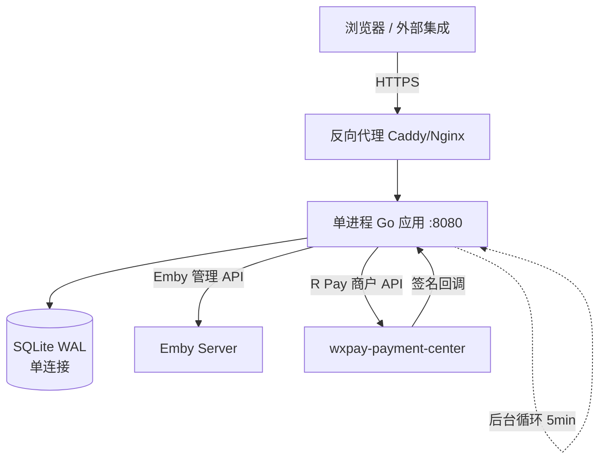
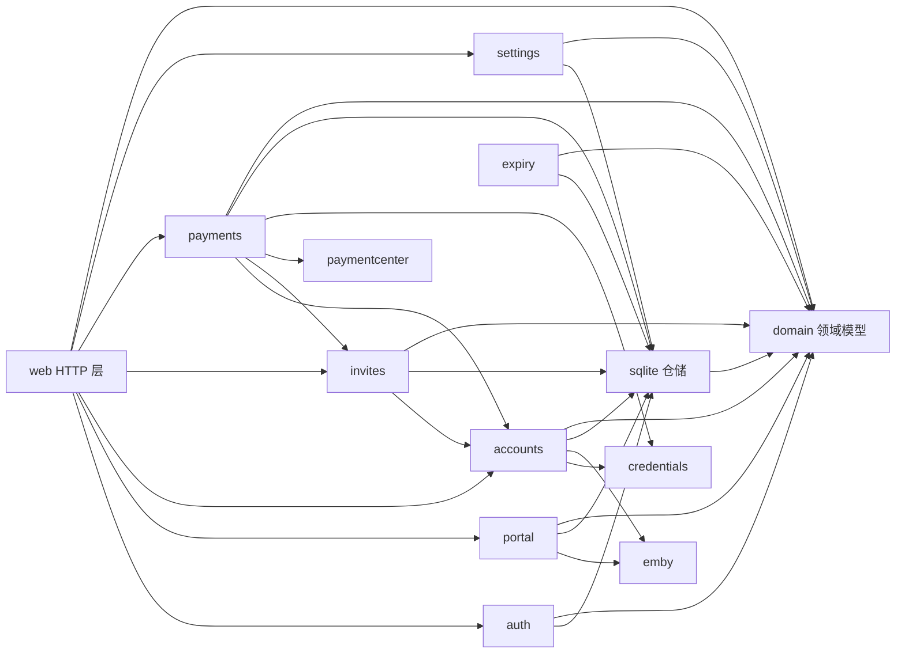

# 架构总览

本文档记录 Emby Service Portal 的运行时拓扑、模块图、依赖规则、关键数据流、外部集成与部署边界。只在真实架构变化时更新；决策背景见 `docs/adr/`，领域职责与术语见 `docs/DOMAIN.md` 与 `CONTEXT.md`。

## 运行时拓扑



- **部署单元**：一个静态 Linux amd64 二进制（`cmd/emby-service-portal`），无前端构建、无缓存、无消息队列。
- **进程内协作者**：HTTP 服务（`internal/web`）+ 后台循环（main.go 内 ticker，5 分钟周期，顺序执行三个任务：账号创建 Saga 恢复 → 到期扫描与 Emby outbox 同步 → 支付订单对账）。
- **SQLite**：WAL 模式、`MaxOpenConns=1`、迁移内嵌于二进制（`//go:embed migrations/*.sql`），时间存储一律 UTC。
- **外部依赖**：仅 Emby 管理 API 与 R Pay 支付中心两个 HTTP 服务。

## 模块图与依赖规则



依赖规则：

1. **分层方向固定**：`web → 应用服务 → sqlite 仓储 → domain 模型`。web 层禁止直接访问仓储（`*sqlite.Store` 只出现在服务与组合根中）；服务是唯一业务规则持有者。
2. **领域模型独立**：实体、领域错误与输入/查询结构体全部位于 `internal/domain`（零依赖，仅标准库）。`persistence/sqlite` 是它的一个适配器实现；任何模块不得定义自己的 `Account`/`PaymentOrder` 副本。
3. **跨域交互走公开服务方法**：`invites → accounts`（创建账号、注册 Saga、密码校验）、`payments → accounts`（续费密码校验）、`payments → invites`（激活码生成）。禁止跨域直读对方表——`payments` 对账号表的读取（`FindAccountByUsername` 等）属于已登记的例外，见 ADR-0003。
4. **禁止循环依赖**：任何新模块不得同时被其依赖方反向依赖。
5. **外部集成只进适配器**：`emby`、`paymentcenter` 包外的代码不得直接调用外部 HTTP 细节。

## 关键数据流

### 1. 账号生命周期（先持久化、后同步）

```
HTTP/API → accounts.Service → sqlite（业务账号 + 乐观锁 version + outbox 行）
worker → expiry.RunOnce → sqlite（到期标记/取 outbox 批）
      → emby.SetUserDisabled → sqlite（按 revision 完成或记录失败重试）
```

启用/禁用/到期一律先写本地期望状态（`emby_access_sync_jobs`，revision 防乱序），再由 worker 调 Emby；失败保留队列重试。

### 2. 账号创建 / 注册（持久化 Saga）

```
请求（Idempotency-Key + 指纹）→ sqlite 记录 operation(pending)
→ 调 Emby 创建（checkpoint: creating → 保存 remote_user_id）
→ 本地落业务账号 + 邀请码兑换 → operation(completed)
```

崩溃后由 worker 的 `RecoverAccountCreates` 按名称查询 Emby 后继续；重试相同幂等键返回原结果，不同请求返回 409。

### 3. 支付履约（本地事务内幂等，回调外调）

```
R Pay 回调 → paymentcenter.VerifyNotification（HMAC + 时间戳 + 金额快照校验）
→ payments.Service → sqlite 事务：按事件 ID 幂等落单（生成激活码 / 延长订阅期）
→ 事务外由 worker 对账补偿（list 200 条 → 单查 → 取消过期订单）
```

回调验签与履约全在本地；SQLite 事务内不调用 Emby 或支付中心。

## 外部集成

| 集成 | 位置 | 说明 |
| --- | --- | --- |
| Emby 管理 API | `internal/emby` | 角色化小接口（`Authenticator`/`PolicyRestricter`/`UserLister`/`UserFinder`/`PasswordSetter`），10s 超时、禁止跟随重定向。 |
| R Pay 支付中心 | `internal/paymentcenter` | 商户签名请求/回调验证/订单查询/取消；商户 Secret 经 `credentials` Vault 加密存储。 |

## 部署边界

- 单实例设计：进程内限流（`ratelimit`）、进程内 worker 互斥（`provisionMu`）。**不得无准备地多实例部署**（见 ADR-0003「何时重开」）。
- 生产必须位于 HTTPS 反向代理之后；`ESP_COOKIE_SECURE=true`。
- 数据库目录建议挂载卷或专用目录以便备份；升级前停止服务或使用 SQLite 在线备份。
- 迁移、`make check`（fmt-check + vet + test + race）在 CI 上强制执行。
